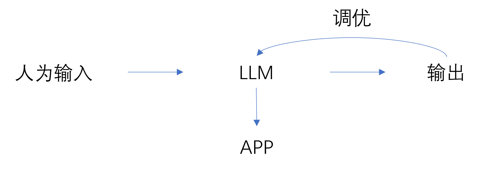
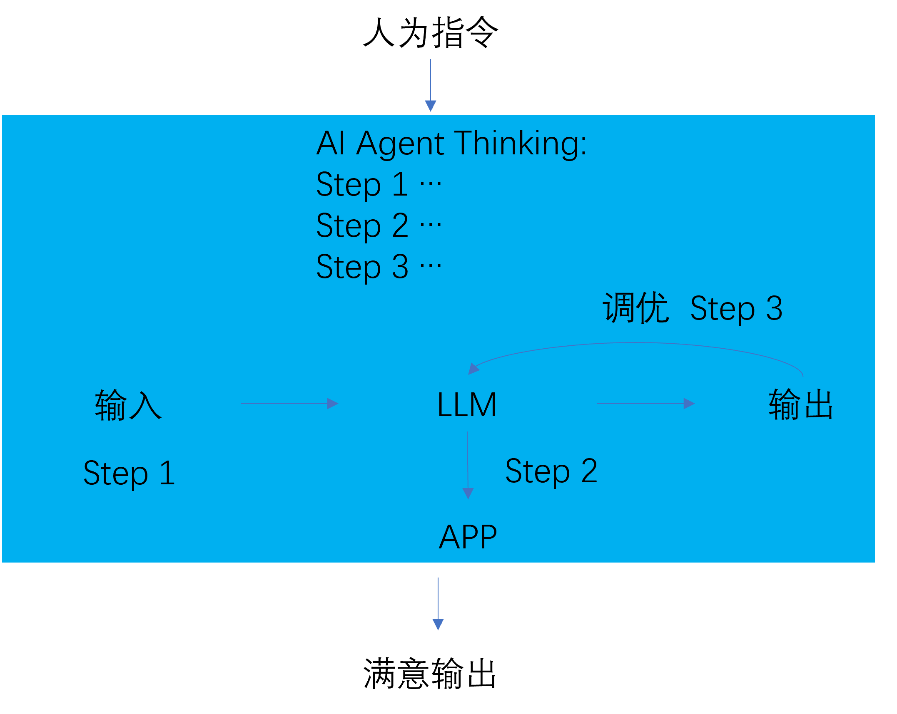

## 2026-1-8 
### 了解LLM、Workflow、Agent之间的一些关系
- LLM大语言模型，主要是来自类似GPT(单向)、BERT(双向)等基础网络骨架块，有两种大方向的类型：1.是通用大模型，海量数据训练得到，主要是用于一些问答方面的任务；2.是专家类的大模型，主要是针对某个特定领域的任务，比如法律、医疗等。
- Workflow工作流，为什么需要建立工作流的概念，因为LLM大模型是无法获取未知信息的。比如，我问LLM，“我要去北京应该买哪个飞机票”，它会根据以往的数据告诉我买哪个票，但是如果我问“今天该飞机票的票价是多少”，它回答不出来，因为我并没有把今天的数据喂给模型，那如果我给LLM去访问我的飞机票APP的权限，让它先判断用户的问题需要到APP中去搜索，然后从APP中搜索到信息后再输出，这就是一个流，其中，可以添加很多个类似的任务，最后我们根据输出人为的对提示词等等做一些调整，直到答案满意。

- Agent智能体，在工作流的基础上，首先输入是人为的，对结果的调优也是人为的，智能体就是用一个LLM去代替人类去完成工作流中的任务。它会自己推理判断每个任务怎么执行最好，对结果判断怎么调优最好，最终输出我们满意的结果。

## 推荐视频
- 📺 [AI Agents, Clearly Explained](https://www.youtube.com/watch?v=FwOTs4UxQS4)